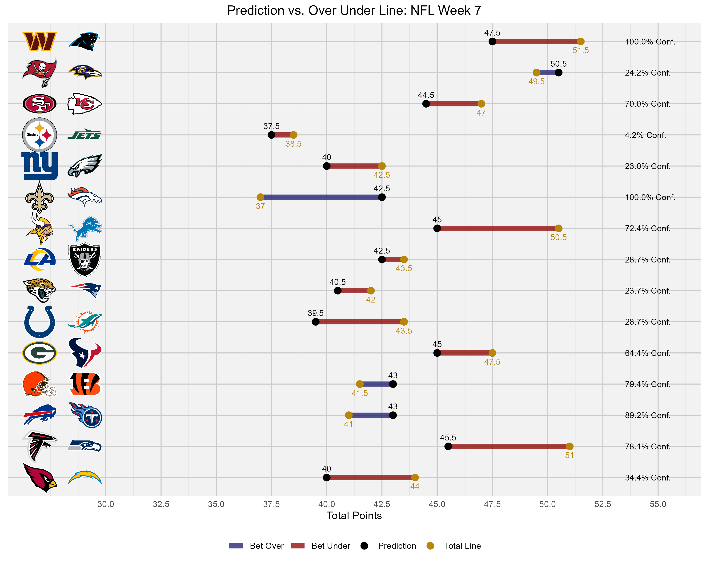
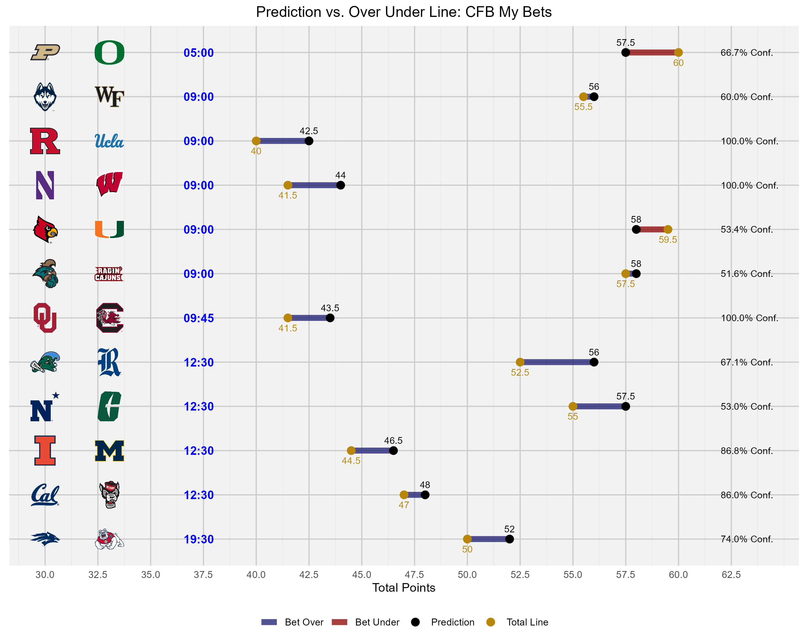

# NFL & CFB Over Under Models

## Overview
This project was designed to analyze Over/Under lines in sportsbooks with the goal of finding "mispriced" lines and taking advantage of them. The process for developing the college model and the NFL model are a little bit different due to available data sources. You'll run the model each week after updating the data, then plug the CSV into R in order to get visually appealing graphics each week. Here's a couple of examples:

